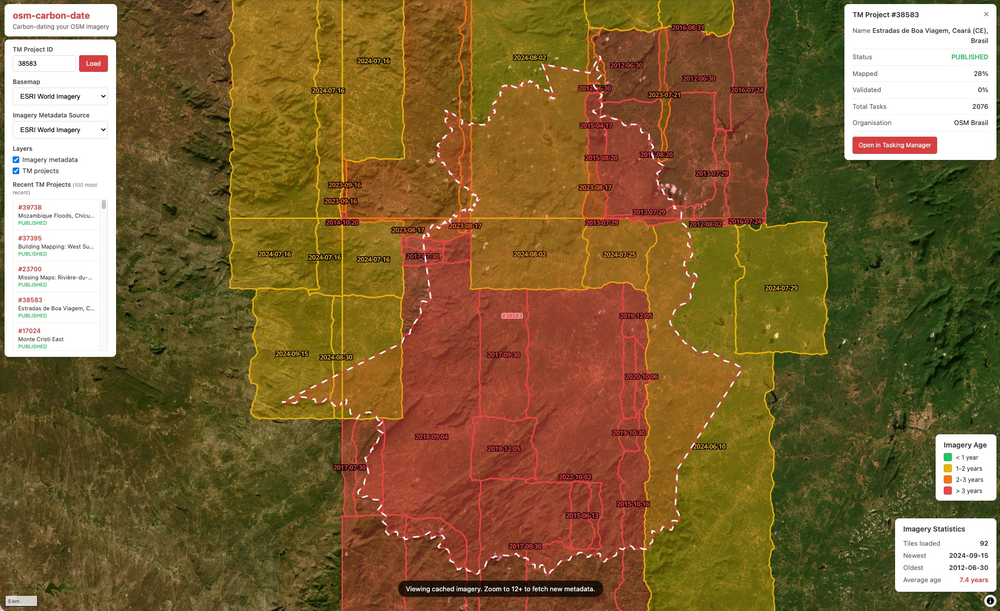

# osm-carbon-date

**Carbon-dating your OSM imagery** — See how old the satellite imagery is behind your mapping projects.

## Live Demo

**[View the app →](https://cgiovando.github.io/osm-carbon-date/)**


*Example: TM Project #38583 in Ceará, Brazil — imagery tiles are color-coded from green (recent) to red (old), with the project boundary shown as a dashed line.*

## The Problem

When creating map data in OpenStreetMap through Tasking Manager projects, we often don't know how current the source imagery is. This leads to:

- Map data that may be months or years out of date
- Missing metadata about imagery age in OSM changesets
- Project managers unable to assess if imagery is suitable for their needs
- No easy way to compare imagery freshness across providers

## The Solution

**osm-carbon-date** overlays Tasking Manager project boundaries with imagery metadata, showing you exactly when each imagery tile was captured — from both ESRI World Imagery and OpenAerialMap.

## Features

- **Dual imagery sources**: Switch between ESRI World Imagery metadata and OpenAerialMap footprints
- **OAM thumbnail overlays**: See actual aerial imagery thumbnails from OpenAerialMap
- **TM project overlay**: Load any Tasking Manager project boundary
- **Color-coded age**: Instantly see imagery freshness (green = recent, red = old)
- **Click for details**: Get imagery dates, resolution, provider, sensor, and GSD
- **Recent projects list**: Browse and load recent TM projects (100 most recent)
- **Basemap switcher**: Compare different basemap providers, with adaptive project boundary colors
- **Age statistics**: View newest/oldest imagery dates for visible area
- **URL deep-linking**: Share links to specific TM projects (e.g., `?project=17232`)
- **Smart caching**: ESRI imagery metadata persists when zooming out (down to z8)

## Imagery Sources

### ESRI World Imagery
- Metadata fetched at zoom 12+ via the ESRI identify API
- Shows tile boundaries with capture dates, resolution, and source info
- Cached data stays visible down to zoom 8

### OpenAerialMap
- ~20,000 drone/aerial imagery footprints loaded from an S3 mirror
- Visible from zoom 8+ with thumbnail overlays and date labels
- Click footprints to see provider, platform, sensor, and GSD
- Oversized mosaics (>1 deg²) are filtered out automatically

## Imagery Age Legend

| Color | Age |
|-------|-----|
| 🟢 Green | < 1 year |
| 🟡 Yellow | 1-2 years |
| 🟠 Orange | 2-3 years |
| 🔴 Red | > 3 years |

## Usage

1. Visit the app at **https://cgiovando.github.io/osm-carbon-date/**
2. Enter a Tasking Manager project ID or click a project from the list
3. Select an imagery metadata source (ESRI or OpenAerialMap)
4. Zoom in to see imagery metadata (zoom 12+ for ESRI, zoom 8+ for OAM)
5. Click on imagery tiles/footprints to see capture dates and details

## Tech Stack

- [MapLibre GL JS](https://maplibre.org/) — Map rendering
- [insta-tm](https://github.com/cgiovando/insta-tm) — S3-hosted TM API mirror (synced every 10 min)
- [PMTiles](https://protomaps.com/docs/pmtiles) — Efficient vector tiles for TM project polygons
- [ESRI ArcGIS REST API](https://developers.arcgis.com/rest/) — Imagery metadata via identify endpoint
- [OpenAerialMap](https://openaerialmap.org/) — Open drone/aerial imagery catalog
- Vanilla JavaScript — No build step required

## Architecture

### TM Project Data

The app uses **insta-tm**, an S3-hosted mirror of Tasking Manager data that syncs every 10 minutes via GitHub Actions. This avoids CORS issues and provides fast, reliable access to:

- All TM projects as a single GeoJSON file (sorted client-side by lastUpdated)
- Individual project details at `/api/v2/projects/{id}`
- PMTiles vector tiles for efficient polygon rendering at low zoom levels

### ESRI Imagery Metadata

Imagery metadata is fetched from ESRI's World Imagery MapServer using the **identify endpoint** with multi-point grid sampling:

- Dual offset grids ensure complete coverage (primary grid + half-cell offset)
- Grid density adapts to zoom level (25-85 sample points)
- Results are cached in-memory while zoom remains ≥ 8
- Label deduplication using centroids prevents overlapping text

### OpenAerialMap Integration

OAM data comes from a static S3 mirror of the OAM catalog (`cgiovando-oam-api`):

- ~20k image footprints loaded as GeoJSON on first selection (lazy-loaded)
- Client-side viewport filtering for efficient rendering
- Thumbnail overlays as MapLibre image sources (max 50 concurrent)
- Oversized images (country-spanning mosaics) filtered by bbox area

### Adaptive UI

- TM project boundaries automatically switch between white (dark basemaps) and dark grey (light basemaps) for visibility
- Imagery source dropdown ensures ESRI and OAM never overlap
- Zoom warning adapts to the selected source

## Deployment

### GitHub Pages

1. Fork/clone this repo
2. Enable GitHub Pages in repo settings (deploy from main branch)
3. The app works out-of-the-box using the public S3 buckets

### Local Development

```bash
# Using Python
python -m http.server 8000

# Using Node
npx serve .
```

Then open `http://localhost:8000`

## AI-Generated Code Disclaimer

**A significant portion of this application's code was generated with assistance from AI tools.**

### Tools Used
- **Claude** (Anthropic) - Code generation, debugging, and documentation

### What This Means
- The codebase was developed with AI assistance based on requirements and iterative prompts
- All functionality has been tested and verified to work as intended
- The code has undergone human review for usability and correctness

## License

MIT

## Credits

- Original ESRI imagery date finder concept by [martinedoesgis](https://github.com/martinedoesgis/esri-imagery-date-finder)
- TM data powered by [insta-tm](https://github.com/cgiovando/insta-tm)
- Aerial imagery catalog by [OpenAerialMap](https://openaerialmap.org/)
